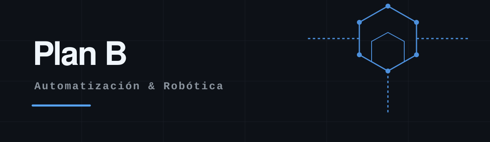

  <picture>
    <source media="(prefers-color-scheme: dark)" srcset="./img/header-dark.svg">
    <source media="(prefers-color-scheme: light)" srcset="./img/header-light.svg">
    
  </picture>

 

La realidad del mercado laboral para desarrolladores con poca experiencia es, siendo honestos, **jodida**.

La irrupción de herramientas de IA ha automatizado muchas de las tareas que antes eran la puerta de entrada para los que empezábamos. Conseguir esa primera oportunidad se ha convertido en un cuello de botella.

Llevo un tiempo buscando trabajo en desarrollo de software y la respuesta es siempre la misma: silencio, procesos eternos o requisitos muy poco realistas. Y mientras tanto, los días pasan y la incertidumbre crece.

Así que he tomado una decisión: **no voy a quedarme parado esperando a que el mercado mejore**.

La FP de **Automatización y Robótica Industrial** es una de las titulaciones con mayor inserción laboral, con demanda creciente por la transformación de la industria hacia la Industria 4.0, y con un perfil profesional que está lejos de estar saturado. Además, me gusta trastear con hardware, ver cómo las cosas se mueven de verdad, no solo píxeles en una pantalla.

Pero hay un problema práctico: las inscripciones a los grados superiores no se abren hasta mayo-junio de 2027, y el curso no arrancaría hasta septiembre. Eso me deja **340 días de espera** (más o menos).

### ¿Y qué hago con esos 340 días?

Dedicar **una o dos horas al día** a ir explorando este mundo nuevo, documentando todo lo que aprenda y construyendo algo tangible.

Eso es exactamente lo que es este repositorio: **Plan B**.

> **Escenario A (el ideal):** Encuentro trabajo de desarrollo de software antes de mayo. Genial, el repo se queda como un proyecto personal de IoT/industria que enriquece mi perfil.
>
> **Escenario B (el realista):** No sale nada en este tiempo. Me matriculo en la FP en junio, empiezo en septiembre, y llego al primer día de clase con 11 meses de ventaja, un GitHub lleno de proyectos documentados y una base técnica que me permitirá destacar para una posible formación dual.

En cualquier caso, **no pierdo nada y gano mucho**.

Este repo no pretende ser un tutorial ni una guía para otros (aunque si te sirve, adelante). Es mi cuaderno de bitácora, mis notas del futuro y mi prueba de que, **cuando el plan A no funciona, siempre puedes construir un plan B con las mismas herramientas que ya tienes**.

---

## Prematriculación

Todo el plan de estudio, los recursos recopilados y los pequeños experimentos de esta fase están documentados aquí: [📁 Carpeta: Plan de Prematriculación]()

---